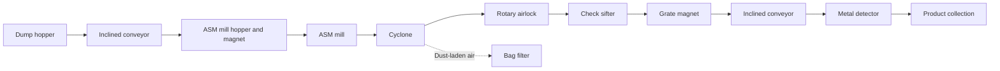

# Turmeric Processing Plant

Project engineering portfolio for the installation and commissioning of **Turmeric Plant 2** at Olam Food Ingredients (ofi).

| Project detail | Description |
| --- | --- |
| Role | Project Engineer Intern |
| Project scope | Planning, procurement, installation, and commissioning of a turmeric processing line |
| Organization | Olam Food Ingredients (ofi) |
| Full report | [Turmeric Processing Plant Project Report](docs/Turmeric_Processing_Plant_Project_Report.pdf) |

## Project objective

The project addressed limitations in the existing grinding system, which had a documented capacity of **150 kg/h** and could not process turmeric bulbs. Turmeric Plant 2 was designed to:

- process turmeric bulbs at a target capacity of **500 kg/h**;
- produce material at **250/300 microns**;
- provide a more spacious layout with separate feeding and finished-goods collection points; and
- introduce cleaner systems and greater process automation.

## My responsibilities

My documented project work covered the plant lifecycle from planning to trial operation:

- Completed project planning and proposal activities and prepared CAD drawings for the plant layout.
- Gathered and stored machinery and equipment for the new processing line.
- Supported site preparation by clearing the installation area, marking machinery locations, and excavating feeder pits.
- Participated in machinery erection, foundation work, and equipment alignment.
- Carried out electrical installation work, including panel-board installation, cable linking, and VFD connections.
- Contributed to additional platforms and handrails, ventilation ducts and fans, PU wall coating, flooring, and safety-rail painting.
- Supported commissioning through equipment testing, trial runs, and adjustments to the impact-mill classifier and sifter angle.
- Worked within documented controls for general work, confined-space work, work at height, hot work, PPE, hazard identification, and emergency response.

## Process equipment

| Equipment | Documented function or specification |
| --- | --- |
| Screw feeder | Feeds raw turmeric into the production line; installed in an 800 mm-deep pit |
| 8-inch screw conveyor | 5 HP drive with reverse/forward VFD control |
| 36 x 18 impact grinding mill | Main size-reduction stage; 100 HP motor with VFD |
| Cyclone | Separates particles using centrifugal force |
| Lifting blower | Provides conveying airflow; 15 HP |
| Rotary airlock valve | Controls bulk-material discharge while limiting pressure loss; 1.5 HP |
| Pulse-jet dust collector | Filters dust from the air stream and uses compressed-air pulses to clean the filter bags |
| 40-bag filter assembly | Dust-filtration equipment listed with a 3 HP drive |
| 60-inch vibro-sifter | Particle separation and grading; 2 HP |
| Packing conveyor | Transfers finished material at the collection stage; 1.5 HP |
| Metal detector | Checks the product stream for metallic contamination; 150 mm diameter, 230 V single phase |

The report also documents magnets, a hydraulic lifting system, ventilation equipment, an LT panel, cable trays, copper cabling, local motor isolators, and emergency trip push buttons.

## Process flow



At the collection point, the metal detector checks for contamination. The report describes a deviator removing detected material before clean product is conveyed to the bagging station, filled into jumbo bags, sealed, labelled, and moved to storage.

## Project timeline

| Period | Documented activity |
| --- | --- |
| May 1-7 | Project planning, proposal, and CAD layout drawings |
| May 8-13 | Machinery procurement and equipment gathering |
| May 14-23 | Site clearing, layout marking, feeder-pit work, and machinery erection |
| May 24-June 2 | Electrical installation, panel board, foundations, handrails, and chequer plates |
| June 3-7 | Ventilation ducts and fans |
| June 7-10 | PU wall coating, flooring, and painting |
| June 13-19 | Trial run and process adjustments |

## Measurable results

| Measure | Reported value |
| --- | --- |
| Existing system capacity | 150 kg/h |
| New-system design capacity | 500 kg/h |
| Product-size design target | 250/300 microns |
| Product size achieved during the trial | 300 microns |
| Total output across trial days | 1,100 kg |
| Trial period | June 13-19 |

The required 300-micron specification was reached after adjusting the impact-mill classifier and the sifter angle. The report does not state a sustained measured hourly throughput for the commissioned line, so the **500 kg/h** figure is presented here as a design target rather than a verified trial result.

## Engineering skills demonstrated

- Plant layout planning and CAD drafting
- Food-process flow and bulk-solids handling
- Mechanical installation, alignment, and foundations
- Electrical installation, motor controls, and VFD integration
- Equipment procurement and material coordination
- Commissioning, trial operation, and process adjustment
- Dust collection, ventilation, and contamination-control systems
- Project scheduling and cross-functional teamwork
- Permit-to-work systems, PPE, and industrial safety practices

## Repository contents

```text
.
|-- README.md
|-- docs/
|   `-- Turmeric_Processing_Plant_Project_Report.pdf
`-- .gitignore
```

## Source

All project facts, figures, responsibilities, and results in this README are based on the included project report prepared by **Eldhose Babu**, Project Engineer Intern. No performance claims beyond those documented in the report have been added.
